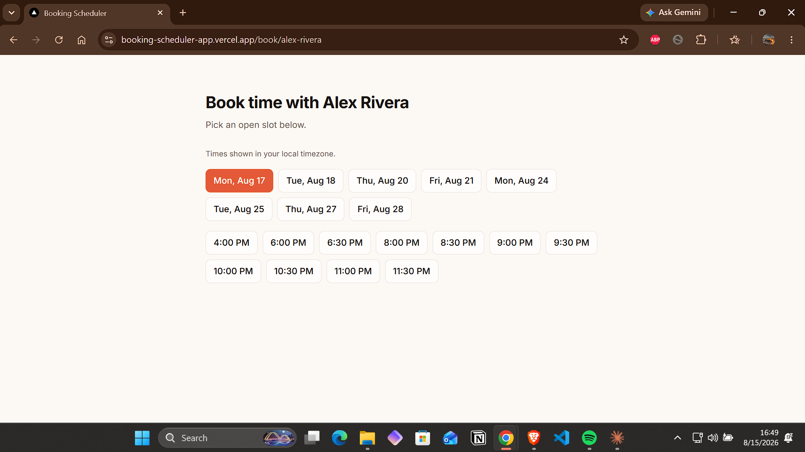
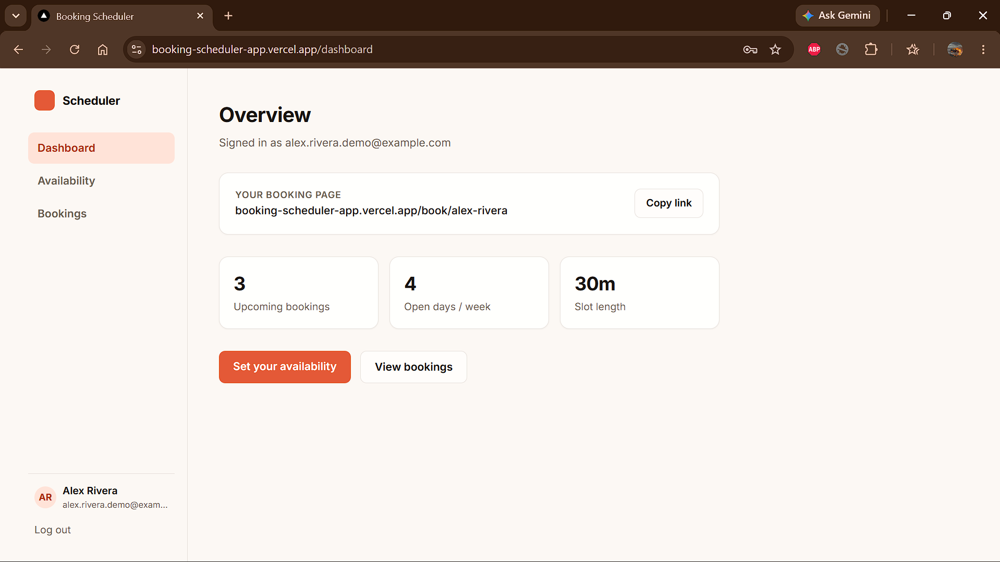
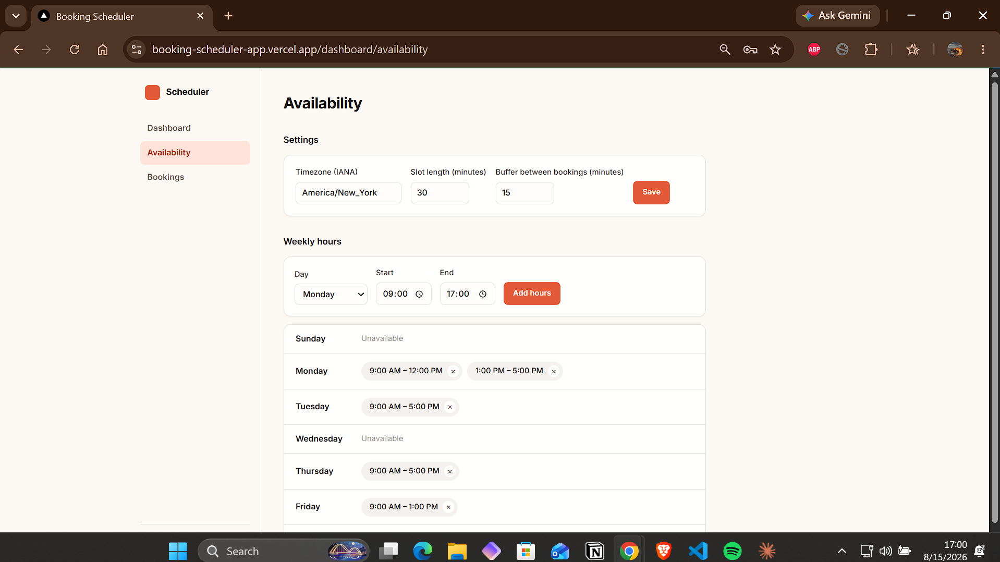
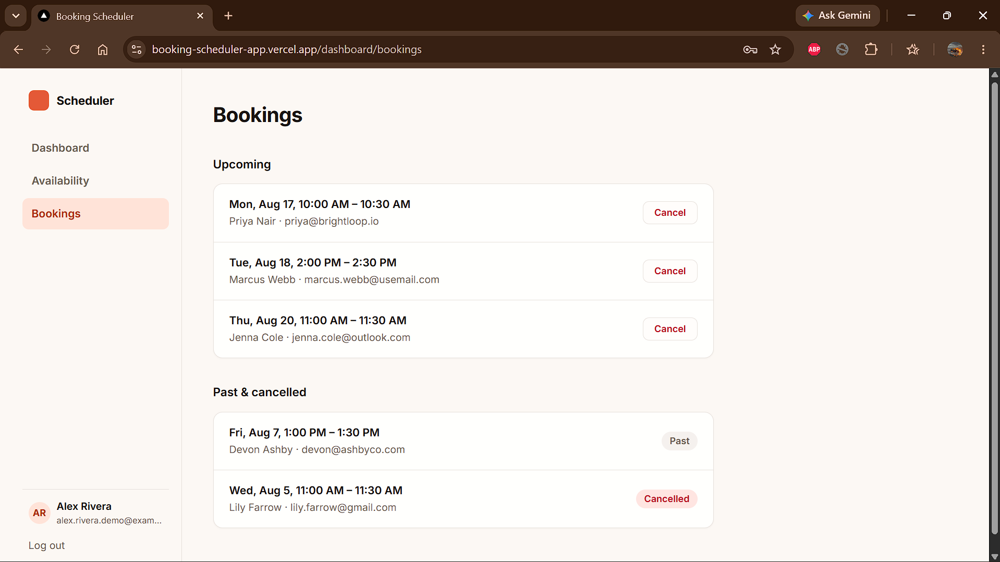

# Booking Scheduler App

A Calendly-style booking app: hosts set their availability, guests book a slot in seconds, no double-bookings possible.

## Live demo

**[booking-scheduler-app.vercel.app](https://booking-scheduler-app.vercel.app)**

Try it as a guest: book a real slot on the demo host's page at **[/book/alex-rivera](https://booking-scheduler-app.vercel.app/book/alex-rivera)** — no account needed. Or try it as a host: sign up yourself, set some weekly availability, and share your own `/book/[slug]` link.

## Preview

<!--
  Drop screenshots into /docs with these exact filenames and they'll show up
  here automatically. See the bottom of this README (or ask Claude) for
  exactly which screens to capture.
-->



| | |
|---|---|
|  |  |
|  | |

## Features

- **Hosts set weekly availability in a few clicks** — pick open hours per day, plus timezone, slot length, and buffer time between bookings
- **Guests book instantly with no back-and-forth** — no account needed, just pick an open slot and enter a name and email
- **Times always shown correctly** — the booking page converts the host's schedule into the guest's own local timezone automatically
- **Race-condition-safe** — two people can never double-book the same slot, enforced by the database itself, not just app logic
- **Hosts manage bookings from a dashboard** — see upcoming and past bookings, cancel with one click
- **Secure by default** — every table is locked down with row-level security; guests can only ever see which times are busy, never other guests' names or emails

## How to use

**As a guest**
1. Open a host's public link (`/book/their-slug`)
2. Pick an open date and time
3. Enter your name and email and confirm — you're booked

**As a host**
1. Sign up and confirm your email
2. Set your weekly availability (hours, timezone, slot length) in the dashboard
3. Share your public booking link with people
4. View or cancel bookings from the dashboard as they come in

## Project structure

```
src
├── app
│   ├── auth
│   │   ├── actions.ts       # server actions: login, signup, logout
│   │   └── confirm/         # email confirmation link handler
│   ├── book
│   │   └── [slug]/          # public guest-facing booking page
│   ├── dashboard
│   │   ├── availability/    # host: weekly hours + timezone/slot settings
│   │   ├── bookings/        # host: view/cancel bookings
│   │   ├── copy-link-button.tsx
│   │   ├── layout.tsx       # sidebar nav + auth guard
│   │   ├── page.tsx         # dashboard overview
│   │   └── sidebar-nav.tsx
│   ├── favicon.ico
│   ├── globals.css          # design tokens (Tailwind v4 @theme)
│   ├── layout.tsx           # root layout, Inter font
│   ├── login/
│   │   └── page.tsx
│   ├── page.tsx              # homepage
│   └── signup
│       ├── check-email/     # post-signup confirmation notice
│       └── page.tsx
├── lib
│   ├── availability.ts      # timezone-aware open-slot computation
│   └── supabase
│       ├── client.ts        # browser Supabase client
│       ├── middleware.ts    # session refresh helper
│       ├── server.ts        # server Supabase client
│       └── types.ts         # hand-written DB types
└── proxy.ts                  # Next.js 16 middleware (route auth guard)
```

## Tech stack

- [Next.js](https://nextjs.org) 16.3.0 (App Router, Server Actions, Turbopack)
- [React](https://react.dev) 19.2.8
- [Supabase](https://supabase.com) — Postgres + Auth (`@supabase/supabase-js` 2.112.3, `@supabase/ssr` 0.12.4)
- [date-fns](https://date-fns.org) 4.4.0 + [date-fns-tz](https://github.com/marnusw/date-fns-tz) 3.2.0 — timezone-correct slot math
- [Tailwind CSS](https://tailwindcss.com) 4
- TypeScript 5

## Setup

1. Install dependencies:

   ```bash
   npm install
   ```

2. Create a Supabase project, then copy `.env.example` to `.env.local` and fill in the values from **Project Settings → API**:

   ```bash
   cp .env.example .env.local
   ```

3. Apply the database schema: open the Supabase SQL Editor and run, in order, everything under `supabase/migrations/` (or use the Supabase CLI once the project is linked).

4. Run the dev server:

   ```bash
   npm run dev
   ```

## Data model

- `profiles` — one row per host (1:1 with `auth.users`), holds the public
  booking slug, timezone, slot length, and buffer. Auto-created on signup
  via a trigger.
- `availability_rules` — weekly recurring open hours per host
  (`day_of_week` + `start_time`/`end_time`).
- `bookings` — guest bookings. A Postgres `EXCLUDE` constraint
  (`btree_gist`) guarantees no two confirmed bookings for the same host can
  have overlapping time ranges, even under concurrent requests. Guests create
  bookings through the `create_booking()` RPC rather than inserting directly.
- `busy_slots` — a narrow public view over `bookings` (just `host_id` +
  time range for confirmed bookings) so the public booking page can compute
  open slots without ever exposing guest names/emails.

Row Level Security is enabled on every table; see `supabase/migrations/`
for the exact policies. Available slot math (weekly rules minus busy ranges,
timezone conversion via `date-fns-tz`) lives in `src/lib/availability.ts`.
